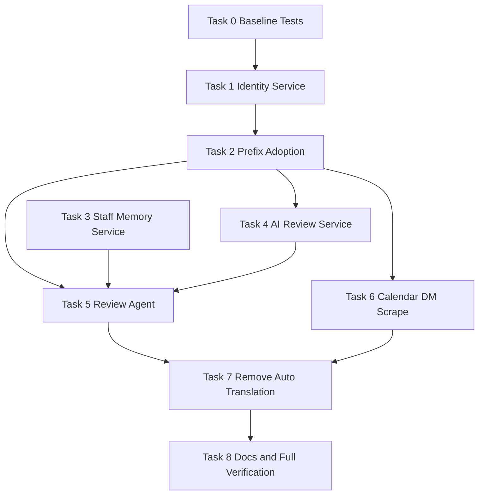

# KPS Assistant Runtime Rework Implementation Plan

> **For agentic workers:** REQUIRED SUB-SKILL: Use superpowers:subagent-driven-development (recommended) or superpowers:executing-plans to implement this plan task-by-task. Steps use checkbox (`- [ ]`) syntax for tracking.

**Goal:** Replace the hardcoded Zeus interaction model with a configurable staff-assistant model that supports runtime identity changes, explicit AI review/translation, KPS-prefixed scrape/review flows, DM-only requester follow-up, structured memory, and weekly importance summaries.

**Architecture:** Add a small identity/prefix layer plus a structured staff-memory layer, then route new explicit commands through a dedicated review/assistant agent while reusing the existing calendar and reminder infrastructure. Keep the current LINE/FastAPI/httpx architecture, but remove always-on translation and centralize model fallback behavior so review/scrape flows use GitHub Models first and OpenRouter second.

**Tech Stack:** Python 3, FastAPI, LINE Bot SDK v3, pytest/pytest-asyncio, existing local JSON persistence, existing Hugging Face optional sync patterns, GitHub Models API, OpenRouter fallback.

**Estimated Complexity:** 9 tasks, 2 XS + 4 S + 3 M

**Critical Path:** Task 0 -> Task 1 -> Task 2 -> Task 4 -> Task 5 -> Task 6 -> Task 7 -> Task 8

**Risk Assessment:**
- Highest risk task: Task 5 - replacing always-on translation with explicit review flow without breaking routing precedence.
- Mitigation: add characterization tests first, keep existing LLM/calendar/search agents intact, and introduce the new command path before removing translation registration.

**Milestones:**
1. Identity and routing foundation - Tasks 0-2
2. Review/memory/calendar workflow - Tasks 3-6
3. Cleanup, docs, and verification - Tasks 7-8

---

## Scope Boundary

Included:
- Runtime-configurable bot display name and aliases
- Admin command to change name/aliases and persist them
- `KPS scrape` behavior using AI extraction and requester-bound DM flow
- `KPS review` behavior for last buffered non-English message
- Weekly priority summary from calendar + structured memory
- Direct DM follow-up only to the requester
- AI-only translation on request
- Removal of Google/Libre auto-translation behavior
- Config/docs updates for LINE/HF/GitHub Models usage

Excluded from this plan:
- New database adoption with Convex/Neon
- GitHub Actions auto-update pipeline
- Broad refactors outside identity, review, calendar reminder delivery, and docs

---

## File Structure Map

### New files
```text
src/services/bot_identity_service.py
src/services/staff_memory_service.py
src/services/ai_review_service.py
src/agents/review_agent.py
tests/test_bot_identity_service.py
tests/test_staff_memory_service.py
tests/test_ai_review_service.py
tests/test_review_agent.py
docs/KPS_ASSISTANT.md
```

### Modified existing files
```text
src/config.py
src/main.py
src/agents/admin_agent.py
src/agents/help_agent.py
src/agents/llm_agent.py
src/agents/search_agent.py
src/agents/calendar_agent.py
src/agents/calendar/scrape_flow.py
src/services/calendar_service.py
src/services/reminder_service.py
src/services/date_extraction_service.py
tests/test_calendar_scrape.py
tests/test_calendar_agent.py
tests/test_search_agent.py
tests/test_admin_agent.py
tests/test_llm_live_data.py
tests/test_llm_reply_token_fallback.py
README.md
CHANGELOG.md
```

---

## Dependency DAG



### Parallel groups
- Parallel Group A after Task 2:
  - Task 3 Staff memory service
  - Task 4 AI review service
  - Task 6 Calendar DM scrape delivery updates
- Parallel Group B after Task 5:
  - Task 7 translation cleanup can begin only after review agent behavior is stable

---

## Milestone 1: Identity and Routing Foundation

**Deliverable:** The bot has configurable identity state and agents can match dynamic prefixes/aliases instead of hardcoded Zeus strings.

**Verification:** focused identity and routing tests pass.

**Rollback point:** after Task 2. System still functions with old behavior preserved behind aliases.

---

### Task 0: Establish Baseline Characterization [Size: XS] [Depends: none]

**Files:**
- Create: `tests/test_bot_identity_characterization.py`
- Modify: `tests/test_calendar_agent.py`
- Modify: `tests/test_search_agent.py`
- Modify: `tests/test_admin_agent.py`

- [ ] **Step 1: Write failing characterization tests for alias-based identity and explicit translation**
```python
import pytest
from unittest.mock import Mock

from src.agents.translation_agent import TranslationAgent

@pytest.mark.asyncio
async def test_translation_agent_does_not_auto_handle_plain_thai_after_rework():
    agent = TranslationAgent()
    event = Mock()
    event.source = Mock()
    event.source.user_id = "U1"
    event.source.type = "group"

    assert await agent.should_handle(event, "สวัสดีครับ") is False
```

```python
import pytest
from unittest.mock import Mock
from src.agents.calendar_agent import CalendarAgent

@pytest.mark.asyncio
async def test_calendar_agent_accepts_configured_alias_prefix():
    agent = CalendarAgent(calendar_service=object())
    assert await agent.should_handle(Mock(message=Mock()), "kps scrape") is True
```

- [ ] **Step 2: Run the failing slice**
Run:
```bash
pytest tests/test_bot_identity_characterization.py tests/test_calendar_agent.py tests/test_search_agent.py tests/test_admin_agent.py -v
```

Expected:
```text
FAILED tests/test_bot_identity_characterization.py::test_translation_agent_does_not_auto_handle_plain_thai_after_rework
FAILED tests/test_calendar_agent.py::test_calendar_agent_accepts_configured_alias_prefix
```

- [ ] **Step 3: Commit the red baseline**
Run:
```bash
git add tests/test_bot_identity_characterization.py tests/test_calendar_agent.py tests/test_search_agent.py tests/test_admin_agent.py
git commit -m "test: capture configurable identity and explicit translation baseline"
```

---

### Task 1: Add Bot Identity Persistence Service [Size: S] [Depends: Task 0]

**Files:**
- Create: `src/services/bot_identity_service.py`
- Create: `tests/test_bot_identity_service.py`
- Modify: `src/config.py`

- [ ] **Step 1: Write failing unit tests for persisted name/alias behavior**
```python
from pathlib import Path

from src.services.bot_identity_service import BotIdentityService


def test_identity_service_loads_defaults_when_state_missing(tmp_path: Path):
    service = BotIdentityService(
        storage_path=tmp_path / "identity.json",
        default_name="KPS-Assistant",
        default_aliases=["kps", "lps-assistant", "hey", "bud", "buddy", "zeus"],
    )

    profile = service.get_profile()

    assert profile.display_name == "KPS-Assistant"
    assert "kps" in profile.aliases
    assert "zeus" in profile.aliases


def test_identity_service_preserves_old_name_as_alias_on_rename(tmp_path: Path):
    service = BotIdentityService(
        storage_path=tmp_path / "identity.json",
        default_name="Zeus",
        default_aliases=["zeus"],
    )

    updated = service.update_identity("KPS-Assistant", ["kps", "buddy"])

    assert updated.display_name == "KPS-Assistant"
    assert "zeus" in updated.aliases
    assert "kps" in updated.aliases
```

- [ ] **Step 2: Run the failing test**
Run:
```bash
pytest tests/test_bot_identity_service.py -v
```

Expected:
```text
FAILED tests/test_bot_identity_service.py::test_identity_service_loads_defaults_when_state_missing
FAILED tests/test_bot_identity_service.py::test_identity_service_preserves_old_name_as_alias_on_rename
```

- [ ] **Step 3: Implement the minimal identity service**
```python
from __future__ import annotations

import json
from dataclasses import dataclass, asdict
from pathlib import Path


@dataclass
class BotIdentityProfile:
    display_name: str
    aliases: list[str]


class BotIdentityService:
    def __init__(self, storage_path: Path, default_name: str, default_aliases: list[str]):
        self._storage_path = Path(storage_path)
        self._default_name = default_name.strip()
        self._default_aliases = self._normalize(default_aliases + [default_name])
        self._profile = self._load()

    def _normalize(self, aliases: list[str]) -> list[str]:
        seen: set[str] = set()
        result: list[str] = []
        for alias in aliases:
            cleaned = (alias or "").strip().lower()
            if cleaned and cleaned not in seen:
                seen.add(cleaned)
                result.append(cleaned)
        return result

    def _load(self) -> BotIdentityProfile:
        if not self._storage_path.exists():
            return BotIdentityProfile(self._default_name, self._default_aliases)
        data = json.loads(self._storage_path.read_text(encoding="utf-8"))
        return BotIdentityProfile(
            display_name=data["display_name"],
            aliases=self._normalize(data["aliases"]),
        )

    def _save(self) -> None:
        self._storage_path.parent.mkdir(parents=True, exist_ok=True)
        self._storage_path.write_text(
            json.dumps(asdict(self._profile), ensure_ascii=False, indent=2),
            encoding="utf-8",
        )

    def get_profile(self) -> BotIdentityProfile:
        return self._profile

    def update_identity(self, display_name: str, aliases: list[str]) -> BotIdentityProfile:
        previous_name = self._profile.display_name
        merged_aliases = self._normalize(aliases + [display_name, previous_name] + self._profile.aliases)
        self._profile = BotIdentityProfile(display_name=display_name.strip(), aliases=merged_aliases)
        self._save()
        return self._profile

    def matches_prefix(self, token: str) -> bool:
        return (token or "").strip().lower() in self._profile.aliases
```

- [ ] **Step 4: Add config defaults for identity storage and startup aliases**
```python
bot_identity_storage_path: str = Field(
    default="./data/bot_identity/profile.json",
    description="Local JSON storage for runtime bot name and aliases.",
)
bot_identity_default_name: str = Field(
    default="KPS-Assistant",
    description="Default runtime display name before admin changes.",
)
bot_identity_default_aliases: str = Field(
    default="kps,lps-assistant,hey,bud,buddy,zeus",
    description="Comma-separated default wake/prefix aliases.",
)
```

- [ ] **Step 5: Run the identity tests again**
Run:
```bash
pytest tests/test_bot_identity_service.py -v
```

Expected:
```text
PASSED tests/test_bot_identity_service.py::test_identity_service_loads_defaults_when_state_missing
PASSED tests/test_bot_identity_service.py::test_identity_service_preserves_old_name_as_alias_on_rename
```

- [ ] **Step 6: Commit**
Run:
```bash
git add src/services/bot_identity_service.py src/config.py tests/test_bot_identity_service.py
git commit -m "feat: add runtime bot identity persistence"
```

---

### Task 2: Adopt Identity Service in Command Matching [Size: M] [Depends: Task 1]

**Files:**
- Modify: `src/main.py`
- Modify: `src/agents/admin_agent.py`
- Modify: `src/agents/help_agent.py`
- Modify: `src/agents/search_agent.py`
- Modify: `src/agents/llm_agent.py`
- Modify: `src/agents/calendar_agent.py`
- Modify: `tests/test_calendar_agent.py`
- Modify: `tests/test_search_agent.py`
- Modify: `tests/test_admin_agent.py`

- [ ] **Step 1: Write failing tests for dynamic prefix adoption**
```python
@pytest.mark.asyncio
async def test_search_agent_handles_runtime_alias_prefix(search_agent, group_message_event):
    assert await search_agent.should_handle(group_message_event, "KPS search python") is True
```

```python
@pytest.mark.asyncio
async def test_admin_agent_handles_runtime_alias_admin_command(admin_agent):
    assert admin_agent._is_admin_command("KPS admin help") is True
```

- [ ] **Step 2: Run focused routing tests**
Run:
```bash
pytest tests/test_calendar_agent.py tests/test_search_agent.py tests/test_admin_agent.py -v
```

Expected:
```text
FAILED tests/test_search_agent.py::test_search_agent_handles_runtime_alias_prefix
FAILED tests/test_admin_agent.py::test_admin_agent_handles_runtime_alias_admin_command
```

- [ ] **Step 3: Replace hardcoded `zeus` prefix checks with identity service lookups**
```python
def _split_prefixed_command(self, text: str) -> tuple[str | None, str]:
    cleaned = re.sub(r"\s+", " ", (text or "").strip())
    if not cleaned:
        return None, ""
    parts = cleaned.split(" ", 1)
    prefix = parts[0].lower()
    rest = parts[1] if len(parts) > 1 else ""
    if bot_identity_service.matches_prefix(prefix):
        return prefix, rest
    return None, cleaned
```

```python
prefix, rest = self._split_prefixed_command(text)
if prefix and rest.lower().startswith("search "):
    return True
```

- [ ] **Step 4: Wire a singleton identity service during startup and inject where needed**
Run implementation edits in:
```text
src/main.py
src/agents/admin_agent.py
src/agents/help_agent.py
src/agents/search_agent.py
src/agents/llm_agent.py
src/agents/calendar_agent.py
```

- [ ] **Step 5: Re-run the routing slice**
Run:
```bash
pytest tests/test_calendar_agent.py tests/test_search_agent.py tests/test_admin_agent.py -v
```

Expected:
```text
PASS
```

- [ ] **Step 6: Commit and mark rollback point**
Run:
```bash
git add src/main.py src/agents/admin_agent.py src/agents/help_agent.py src/agents/search_agent.py src/agents/llm_agent.py src/agents/calendar_agent.py tests/test_calendar_agent.py tests/test_search_agent.py tests/test_admin_agent.py
git commit -m "refactor: adopt runtime identity service across command routing"
```

**Rollback point:** safe stop. Prefix behavior is centralized; translation behavior is still present.

---

## Milestone 2: Review, Memory, and DM Workflow

**Deliverable:** `KPS review`, `KPS scrape`, DM-only requester follow-up, structured weekly memory, and requester-targeted reminder delivery work end-to-end.

**Verification:** focused review/scrape/memory tests pass.

**Rollback point:** after Task 6. New behavior exists without removing old translation code yet.

---

### Task 3: Add Structured Staff Memory Service [Size: S] [Depends: Task 2]

**Files:**
- Create: `src/services/staff_memory_service.py`
- Create: `tests/test_staff_memory_service.py`

- [ ] **Step 1: Write failing tests for important-item persistence**
```python
from datetime import date
from src.services.staff_memory_service import StaffMemoryService

def test_staff_memory_saves_and_ranks_week_items(tmp_path):
    service = StaffMemoryService(tmp_path / "staff_memory.json")
    service.add_item(
        title="Flag ceremony practice",
        summary="Flag ceremony practice this week",
        priority="P1",
        due_date=date(2026, 6, 2),
        source_chat_id="group_G1",
        created_by="U1",
    )

    items = service.get_items_for_week(date(2026, 6, 1))
    assert len(items) == 1
    assert items[0].priority == "P1"
```

- [ ] **Step 2: Run failing memory tests**
Run:
```bash
pytest tests/test_staff_memory_service.py -v
```

Expected:
```text
FAILED tests/test_staff_memory_service.py::test_staff_memory_saves_and_ranks_week_items
```

- [ ] **Step 3: Implement minimal structured memory store**
```python
from __future__ import annotations

import json
import uuid
from dataclasses import dataclass, asdict
from datetime import date, timedelta
from pathlib import Path


@dataclass
class StaffMemoryItem:
    item_id: str
    title: str
    summary: str
    priority: str
    due_date: str | None
    source_chat_id: str
    created_by: str


class StaffMemoryService:
    def __init__(self, storage_path: Path):
        self._storage_path = Path(storage_path)
        self._items = self._load()

    def _load(self) -> list[StaffMemoryItem]:
        if not self._storage_path.exists():
            return []
        raw = json.loads(self._storage_path.read_text(encoding="utf-8"))
        return [StaffMemoryItem(**item) for item in raw]

    def _save(self) -> None:
        self._storage_path.parent.mkdir(parents=True, exist_ok=True)
        self._storage_path.write_text(
            json.dumps([asdict(item) for item in self._items], indent=2),
            encoding="utf-8",
        )

    def add_item(self, title: str, summary: str, priority: str, due_date: date | None, source_chat_id: str, created_by: str) -> StaffMemoryItem:
        item = StaffMemoryItem(
            item_id=str(uuid.uuid4()),
            title=title,
            summary=summary,
            priority=priority,
            due_date=due_date.isoformat() if due_date else None,
            source_chat_id=source_chat_id,
            created_by=created_by,
        )
        self._items.append(item)
        self._save()
        return item

    def get_items_for_week(self, week_start: date) -> list[StaffMemoryItem]:
        week_end = week_start + timedelta(days=6)
        ranked = []
        for item in self._items:
            if not item.due_date:
                ranked.append(item)
                continue
            due = date.fromisoformat(item.due_date)
            if week_start <= due <= week_end:
                ranked.append(item)
        return sorted(ranked, key=lambda item: (item.priority, item.due_date or "9999-12-31"))
```

- [ ] **Step 4: Re-run staff memory tests**
Run:
```bash
pytest tests/test_staff_memory_service.py -v
```

Expected:
```text
PASS
```

- [ ] **Step 5: Commit**
Run:
```bash
git add src/services/staff_memory_service.py tests/test_staff_memory_service.py
git commit -m "feat: add structured staff memory store"
```

---

### Task 4: Add AI Review Service With Provider Fallback [Size: S] [Depends: Task 2]

**Files:**
- Create: `src/services/ai_review_service.py`
- Create: `tests/test_ai_review_service.py`
- Modify: `src/services/date_extraction_service.py`

- [ ] **Step 1: Write failing tests for GitHub Models primary and OpenRouter fallback**
```python
import pytest
from unittest.mock import AsyncMock

from src.services.ai_review_service import AIReviewService


@pytest.mark.asyncio
async def test_ai_review_service_uses_github_models_first():
    github = AsyncMock()
    github.chat_completion.return_value = "translated text"
    openrouter = AsyncMock()

    service = AIReviewService(github_service=github, openrouter_service=openrouter)
    result = await service.translate_and_summarize("ข้อความภาษาไทย")

    assert result == "translated text"
    github.chat_completion.assert_awaited_once()
    openrouter.chat_completion.assert_not_awaited()
```

- [ ] **Step 2: Run the failing test**
Run:
```bash
pytest tests/test_ai_review_service.py -v
```

Expected:
```text
FAILED tests/test_ai_review_service.py::test_ai_review_service_uses_github_models_first
```

- [ ] **Step 3: Implement minimal AI review service**
```python
class AIReviewService:
    def __init__(self, github_service, openrouter_service):
        self.github_service = github_service
        self.openrouter_service = openrouter_service

    async def _complete(self, messages, github_model="openai/gpt-4o-mini", openrouter_model="openai/gpt-4o"):
        if self.github_service and self.github_service.is_configured():
            response = await self.github_service.chat_completion(messages=messages, model=github_model, temperature=0.2, max_tokens=900)
            if response:
                return response
        if self.openrouter_service and self.openrouter_service.is_configured():
            return await self.openrouter_service.chat_completion(messages=messages, model=openrouter_model, temperature=0.2)
        return None

    async def translate_and_summarize(self, text: str) -> str | None:
        messages = [
            {"role": "system", "content": "Translate the non-English message into English, summarize it clearly, and suggest calendar-worthy actions. Output concise plain text."},
            {"role": "user", "content": text},
        ]
        return await self._complete(messages)

    async def extract_calendar_candidates(self, texts: list[str]) -> str | None:
        messages = [
            {"role": "system", "content": "Extract date-bearing events for school staff planning. Return JSON only."},
            {"role": "user", "content": "\n".join(texts)},
        ]
        return await self._complete(messages)
```

- [ ] **Step 4: Point date extraction fallback chain through the new review service**
Modify the extraction branch in `src/services/date_extraction_service.py` so the call order becomes:
```text
GitHub Models openai/gpt-4o-mini
-> OpenRouter openai/gpt-4o
-> existing regex fallback
```

- [ ] **Step 5: Re-run focused service tests**
Run:
```bash
pytest tests/test_ai_review_service.py tests/test_calendar_scrape.py -v
```

Expected:
```text
PASS
```

- [ ] **Step 6: Commit**
Run:
```bash
git add src/services/ai_review_service.py src/services/date_extraction_service.py tests/test_ai_review_service.py tests/test_calendar_scrape.py
git commit -m "feat: add ai review service with provider fallback"
```

---

### Task 5: Add Explicit Review Agent and DM Follow-Up [Size: M] [Depends: Task 2, Task 3, Task 4]

**Files:**
- Create: `src/agents/review_agent.py`
- Create: `tests/test_review_agent.py`
- Modify: `src/main.py`

- [ ] **Step 1: Write failing review-flow tests**
```python
import pytest
from unittest.mock import Mock

from src.agents.review_agent import ReviewAgent


@pytest.mark.asyncio
async def test_review_agent_translates_last_non_english_message_and_pushes_dm():
    line_api = Mock()
    line_api.push_message = Mock()
    event = Mock()
    event.reply_token = "reply"
    event.source = Mock()
    event.source.user_id = "U_REQ"
    event.source.group_id = "G1"
    event.source.type = "group"

    agent = ReviewAgent(...)
    handled = await agent.handle(event, "KPS review", line_api)

    assert handled is True
    assert line_api.push_message.called
```

- [ ] **Step 2: Run failing review tests**
Run:
```bash
pytest tests/test_review_agent.py -v
```

Expected:
```text
FAILED tests/test_review_agent.py::test_review_agent_translates_last_non_english_message_and_pushes_dm
```

- [ ] **Step 3: Implement review agent behavior**
Core behavior:
```python
if command == "review":
    last_message = message_buffer_service.get_last_non_english_message(chat_id, exclude_user_id=bot_user_id)
    summary = await ai_review_service.translate_and_summarize(last_message.text)
    await reply_in_group("I sent the review to your DM.")
    await push_to_requester_dm(user_id, summary + "\n\nWould you like to add this to the calendar, memory, both, or neither?")
```

Required sub-behaviors:
```text
- requester ownership enforced via event.source.user_id
- group gets only minimal acknowledgement
- DM gets the translated review and next-step options
- accepted save options write to structured memory and optionally calendar
- “who do you work for?” returns the fixed staff-assistant answer
```

- [ ] **Step 4: Register the new agent before LLM and after calendar**
Modify startup order in `src/main.py`:
```text
Help 5
Admin 5
Calendar 6
Review 8
Search 8
LLM 9
Translation removed later in Task 7
```

- [ ] **Step 5: Re-run review tests**
Run:
```bash
pytest tests/test_review_agent.py -v
```

Expected:
```text
PASS
```

- [ ] **Step 6: Commit**
Run:
```bash
git add src/agents/review_agent.py src/main.py tests/test_review_agent.py
git commit -m "feat: add explicit review agent with requester dm follow-up"
```

---

### Task 6: Rework `KPS scrape` for Requester-Bound DM and Reminder Targeting [Size: M] [Depends: Task 2, Task 4]

**Files:**
- Modify: `src/agents/calendar_agent.py`
- Modify: `src/agents/calendar/scrape_flow.py`
- Modify: `src/services/calendar_service.py`
- Modify: `src/services/reminder_service.py`
- Modify: `tests/test_calendar_scrape.py`
- Modify: `tests/test_calendar_agent.py`

- [ ] **Step 1: Write failing tests for discrete scrape and DM-only reminder delivery**
```python
@pytest.mark.asyncio
async def test_scrape_flow_pushes_review_to_requester_dm_when_run_from_group():
    ...
    await flow.handle_scrape_trigger(event, "kps scrape", line_api, "group_G1", "U_REQ", discrete_mode=True)
    assert line_api.push_message.called
```

```python
def test_calendar_event_persists_notification_target_user_id():
    event = CalendarEvent(
        event_id="1",
        user_id="U_REQ",
        chat_id="group_G1",
        title="Exam papers due",
        event_date=date(2026, 6, 5),
        reminder_days=[1, 0],
        is_friend=True,
        notification_target_user_id="U_REQ",
    )
    assert event.to_dict()["notification_target_user_id"] == "U_REQ"
```

- [ ] **Step 2: Run the failing calendar slice**
Run:
```bash
pytest tests/test_calendar_scrape.py tests/test_calendar_agent.py -v
```

Expected:
```text
FAILED tests/test_calendar_scrape.py::test_scrape_flow_pushes_review_to_requester_dm_when_run_from_group
FAILED tests/test_calendar_scrape.py::test_calendar_event_persists_notification_target_user_id
```

- [ ] **Step 3: Add explicit reminder target to calendar events**
Implement in `src/services/calendar_service.py`:
```python
class CalendarEvent:
    def __init__(..., notification_target_user_id: str | None = None):
        ...
        self.notification_target_user_id = notification_target_user_id or user_id

    def to_dict(self):
        return {
            ...
            "notification_target_user_id": self.notification_target_user_id,
        }
```

- [ ] **Step 4: Route scrape interaction and reminders to the requester DM**
Implementation rules:
```text
- `KPS scrape` in group replies once: “I’ll continue in your DM.”
- extracted-event review prompts use push_message to requester user_id only
- accepted events store `notification_target_user_id=requester_user_id`
- reminder delivery ignores original group if `notification_target_user_id` is present
```

Reminder delivery branch:
```python
target = event.notification_target_user_id or fallback_chat_target
```

- [ ] **Step 5: Re-run calendar-focused tests**
Run:
```bash
pytest tests/test_calendar_scrape.py tests/test_calendar_agent.py tests/test_calendar_security.py -v
```

Expected:
```text
PASS
```

- [ ] **Step 6: Commit and mark rollback point**
Run:
```bash
git add src/agents/calendar_agent.py src/agents/calendar/scrape_flow.py src/services/calendar_service.py src/services/reminder_service.py tests/test_calendar_scrape.py tests/test_calendar_agent.py
git commit -m "feat: deliver scrape reviews and reminders to requester dm"
```

**Rollback point:** stable feature slice. Review and scrape are requester-bound and persisted cleanly.

---

## Milestone 3: Translation Cleanup, Weekly Summary, and Documentation

**Deliverable:** Only explicit AI review/translation remains, weekly importance summaries work, and docs/config are updated.

**Verification:** focused behavior tests plus full pytest pass.

---

### Task 7: Remove Always-On Translation and Add Weekly Summary Behavior [Size: S] [Depends: Task 5, Task 6]

**Files:**
- Modify: `src/agents/review_agent.py`
- Modify: `src/agents/translation_agent.py`
- Modify: `src/main.py`
- Modify: `src/agents/help_agent.py`
- Modify: `tests/test_bot_identity_characterization.py`
- Modify: `tests/test_llm_live_data.py`
- Modify: `tests/test_llm_reply_token_fallback.py`

- [ ] **Step 1: Write failing tests for “important this week” and disabled auto-translation**
```python
@pytest.mark.asyncio
async def test_review_agent_summarizes_weekly_priorities_from_calendar_and_memory():
    ...
    result = await agent.handle(event, "KPS whats important this week?", line_api)
    assert result is True
```

```python
@pytest.mark.asyncio
async def test_plain_non_prefixed_thai_no_longer_triggers_translation():
    ...
    assert await translation_agent.should_handle(event, "สวัสดีครับ") is False
```

- [ ] **Step 2: Run the failing tests**
Run:
```bash
pytest tests/test_bot_identity_characterization.py tests/test_review_agent.py -v
```

Expected:
```text
FAILED tests/test_review_agent.py::test_review_agent_summarizes_weekly_priorities_from_calendar_and_memory
FAILED tests/test_bot_identity_characterization.py::test_plain_non_prefixed_thai_no_longer_triggers_translation
```

- [ ] **Step 3: Implement weekly summary and translation shutdown**
Rules:
```text
- review agent command `important this week` collects:
  - calendar events due in next 7 days
  - staff memory items due in next 7 days
- response formats top items as P1/P2/P3
- translation agent either becomes disabled by config or returns False for non-explicit command input
- remove translation agent registration from startup once tests are green
```

Representative summary formatter:
```python
def _format_week_summary(items):
    lines = []
    for idx, item in enumerate(items[:5], start=1):
        lines.append(f"{item.priority} - {item.title}")
    return "\n".join(lines) if lines else "Nothing critical is recorded for this week."
```

- [ ] **Step 4: Re-run the focused slice**
Run:
```bash
pytest tests/test_bot_identity_characterization.py tests/test_review_agent.py -v
```

Expected:
```text
PASS
```

- [ ] **Step 5: Commit**
Run:
```bash
git add src/agents/review_agent.py src/agents/translation_agent.py src/main.py src/agents/help_agent.py tests/test_bot_identity_characterization.py tests/test_review_agent.py
git commit -m "refactor: replace auto translation with explicit review and weekly summary"
```

---

### Task 8: Documentation, Config Guidance, and Full Verification [Size: S] [Depends: Task 7]

**Files:**
- Create: `docs/KPS_ASSISTANT.md`
- Modify: `README.md`
- Modify: `CHANGELOG.md`
- Modify: `.github/copilot-instructions.md`

- [ ] **Step 1: Write/update docs**
Document:
```text
- admin identity commands
- default aliases and persistence location
- `KPS review`
- `KPS scrape`
- DM reminder behavior and LINE friendship requirement
- GitHub Models primary / OpenRouter fallback
- statement that requester user ID comes from LINE events, not HF terminal scraping
- operational note: no Convex/Neon in this release
```

- [ ] **Step 2: Run focused regression first**
Run:
```bash
pytest tests/test_bot_identity_service.py tests/test_staff_memory_service.py tests/test_ai_review_service.py tests/test_review_agent.py tests/test_calendar_scrape.py tests/test_calendar_agent.py -v
```

Expected:
```text
PASS
```

- [ ] **Step 3: Run full verification**
Run:
```bash
pytest -v
```

Expected:
```text
============================= test session starts =============================
...
============================= all tests passed ===============================
```

- [ ] **Step 4: Run a startup sanity check**
Run:
```bash
python -m uvicorn src.main:app --reload --port 8000
```

Expected:
```text
INFO:     Uvicorn running on http://127.0.0.1:8000
...
KPS/assistant agents registered
```

- [ ] **Step 5: Commit**
Run:
```bash
git add docs/KPS_ASSISTANT.md README.md CHANGELOG.md .github/copilot-instructions.md
git commit -m "docs: document kps assistant runtime behavior"
```

---

## Verification Checklist

- [ ] Runtime bot identity can be changed without code edits
- [ ] Old names remain aliases after rename unless explicitly removed
- [ ] `KPS scrape` works from group chat and moves interaction to requester DM
- [ ] Reminder delivery targets the requester DM, not the original group, when configured
- [ ] `KPS review` finds the last buffered non-English message and sends translated summary to requester DM
- [ ] User can save reviewed content to calendar, memory, both, or neither
- [ ] `KPS whats important this week?` ranks near-term calendar and staff-memory items
- [ ] `KPS who do you work for?` returns the fixed staff-assistant response
- [ ] Google/Libre auto-translation paths are no longer active in runtime routing
- [ ] GitHub Models uses `openai/gpt-4o-mini` first and falls back to OpenRouter `openai/gpt-4o`
- [ ] Docs explain LINE friendship/DM delivery limitations clearly

---

## Risks and Practical Notes

- DM delivery depends on the bot being allowed to push to the requester’s LINE user ID. The implementation should document this as a runtime prerequisite, not hide it.
- Message review can only inspect buffered webhook text already seen by the bot in the last retention window; it cannot fetch arbitrary LINE history.
- The plan deliberately avoids a new database because existing local JSON + optional HF sync already matches the repo’s persistence model and keeps this feature set implementable in one slice.