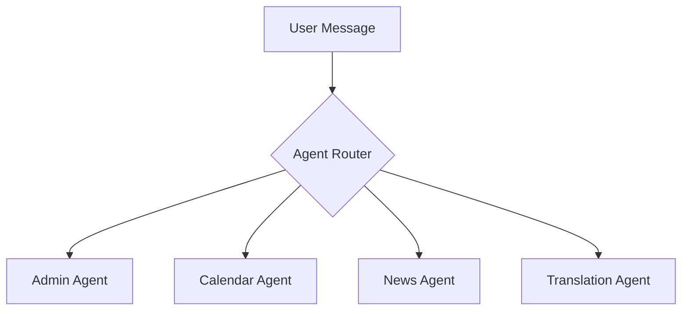

# Documentation Debt Backlog

**Project:** Zeus/TeacherBOY  
**Last Updated:** 2026-01-11  
**Purpose:** Track prioritized documentation improvements and technical debt

---

## Overview

This document tracks all remaining documentation improvements identified during the comprehensive 5-phase audit. Items are prioritized by impact and organized by effort required.

**Current Status:**

- **Total Items:** 47
- **High Priority:** 15 items
- **Medium Priority:** 18 items
- **Low Priority:** 14 items

**Progress Tracking:**

- ✅ Completed
- 🔄 In Progress
- 📋 Backlog
- ❌ Blocked

---

## High Priority Items (Week 1-2)

**Impact: User-facing documentation quality improvements**

| #   | Item                                             | Effort    | Status | Owner         | Due Date   |
| --- | ------------------------------------------------ | --------- | ------ | ------------- | ---------- |
| H1  | Add metadata to core user guides                 | 3 hours   | 📋     | Doc Lead      | 2026-01-15 |
| H2  | Create CONTRIBUTING.md                           | 2 hours   | 📋     | Project Lead  | 2026-01-15 |
| H3  | Fix quick-reference.md H1 title                  | 10 min    | 📋     | Anyone        | 2026-01-10 |
| H4  | Create Help Agent standalone documentation       | 2 hours   | 📋     | Feature Owner | 2026-01-15 |
| H5  | Create Image Analyzer usage guide                | 2 hours   | 📋     | Feature Owner | 2026-01-15 |
| H6  | Update DOCUMENTATION_INDEX.md last modified date | 5 min     | 📋     | Anyone        | 2026-01-10 |
| H7  | Validate top 10 external links                   | 1 hour    | 📋     | Doc Lead      | 2026-01-15 |
| H8  | Create SECURITY.md                               | 1.5 hours | 📋     | Security Lead | 2026-01-15 |
| H9  | Complete/delete FIX_SUMMARY_REPLY_TOKEN.md       | 30 min    | 📋     | Feature Owner | 2026-01-12 |
| H10 | Standardize terminology in README.md             | 30 min    | 📋     | Doc Lead      | 2026-01-15 |
| H11 | Add troubleshooting to CONVERSATION_MEMORY.md    | 1 hour    | 📋     | Feature Owner | 2026-01-15 |
| H12 | Create Calendar Agent troubleshooting section    | 1 hour    | 📋     | Feature Owner | 2026-01-15 |
| H13 | Document rate limiting for all agents            | 1.5 hours | 📋     | Backend Lead  | 2026-01-15 |
| H14 | Add session manager documentation                | 2 hours   | 📋     | Backend Lead  | 2026-01-15 |
| H15 | Create quick reference for common errors         | 2 hours   | 📋     | Support Team  | 2026-01-15 |

**Total High Priority Effort:** ~19 hours

---

## Medium Priority Items (Week 3-4)

**Impact: Developer experience and documentation completeness**

| #   | Item                                      | Effort  | Status | Owner           | Due Date   |
| --- | ----------------------------------------- | ------- | ------ | --------------- | ---------- |
| M1  | Add metadata to architecture docs         | 1 hour  | 📋     | Architect       | 2026-01-22 |
| M2  | Add metadata to reference docs            | 1 hour  | 📋     | Doc Lead        | 2026-01-22 |
| M3  | Standardize terminology in feature docs   | 2 hours | 📋     | Doc Lead        | 2026-01-22 |
| M4  | Create comprehensive service reference    | 4 hours | 📋     | Backend Lead    | 2026-01-29 |
| M5  | Add examples to all admin commands        | 2 hours | 📋     | Admin Team      | 2026-01-22 |
| M6  | Document error codes and meanings         | 2 hours | 📋     | Backend Lead    | 2026-01-29 |
| M7  | Create testing guide for contributors     | 3 hours | 📋     | QA Lead         | 2026-01-29 |
| M8  | Document deployment best practices        | 2 hours | 📋     | DevOps          | 2026-01-29 |
| M9  | Add monitoring and alerting guide         | 2 hours | 📋     | DevOps          | 2026-01-29 |
| M10 | Create backup and recovery procedures     | 2 hours | 📋     | DevOps          | 2026-01-29 |
| M11 | Document performance tuning options       | 3 hours | 📋     | Backend Lead    | 2026-01-29 |
| M12 | Add architecture decision records (ADRs)  | 4 hours | 📋     | Architect       | 2026-01-29 |
| M13 | Create developer onboarding guide         | 3 hours | 📋     | Tech Lead       | 2026-01-29 |
| M14 | Document code review standards            | 2 hours | 📋     | Tech Lead       | 2026-01-29 |
| M15 | Add migration guides for version upgrades | 3 hours | 📋     | Release Manager | 2026-01-29 |
| M16 | Create troubleshooting flowcharts         | 3 hours | 📋     | Support Team    | 2026-01-29 |
| M17 | Document CI/CD pipeline                   | 2 hours | 📋     | DevOps          | 2026-01-29 |
| M18 | Add API rate limiting documentation       | 2 hours | 📋     | Backend Lead    | 2026-01-29 |

**Total Medium Priority Effort:** ~43 hours

---

## Low Priority Items (Month 2-3)

**Impact: Polish and enhancement**

| #   | Item                                         | Effort   | Status | Owner            | Due Date   |
| --- | -------------------------------------------- | -------- | ------ | ---------------- | ---------- |
| L1  | Complete TeacherBOY → Zeus naming transition | 1 hour   | 📋     | Doc Lead         | 2026-02-15 |
| L2  | Add diagrams to architecture docs            | 4 hours  | 📋     | Architect        | 2026-02-28 |
| L3  | Create FAQ document                          | 3 hours  | 📋     | Support Team     | 2026-02-28 |
| L4  | Add video walkthroughs                       | 8 hours  | 📋     | Doc Lead         | 2026-03-15 |
| L5  | Create Thai language translations            | 10 hours | 📋     | Translation Team | 2026-03-31 |
| L6  | Add interactive examples                     | 6 hours  | 📋     | Frontend Dev     | 2026-03-15 |
| L7  | Create glossary of terms                     | 2 hours  | 📋     | Doc Lead         | 2026-02-28 |
| L8  | Add code coverage documentation              | 2 hours  | 📋     | QA Lead          | 2026-02-28 |
| L9  | Create release checklist template            | 1 hour   | 📋     | Release Manager  | 2026-02-15 |
| L10 | Document feature flag system                 | 2 hours  | 📋     | Backend Lead     | 2026-02-28 |
| L11 | Add performance benchmarks                   | 3 hours  | 📋     | Performance Team | 2026-03-15 |
| L12 | Create style guide for code examples         | 2 hours  | 📋     | Doc Lead         | 2026-02-28 |
| L13 | Add accessibility documentation              | 2 hours  | 📋     | Product Manager  | 2026-03-15 |
| L14 | Create documentation templates               | 2 hours  | 📋     | Doc Lead         | 2026-02-15 |

**Total Low Priority Effort:** ~48 hours

---

## Detailed Item Descriptions

### HIGH PRIORITY

#### H1: Add Metadata to Core User Guides

**Files to update:**

- `docs/guides/quickstart.md`
- `docs/guides/deployment.md`
- `docs/guides/line-setup.md`
- `docs/guides/admin.md`

**Required metadata:**

```markdown
---

**Last Updated:** 2026-01-11  
**Applies to Version:** 3.5.1+  
**Audience:** [specific audience]  
**Status:** Stable
```

**Acceptance Criteria:**

- [ ] All 4 files have consistent metadata
- [ ] Dates use ISO 8601 format
- [ ] Audience clearly identified
- [ ] Status reflects current state

---

#### H2: Create CONTRIBUTING.md

**Location:** Root directory  
**Purpose:** Guide contributors on how to contribute code and documentation

**Required sections:**

- Code of conduct
- How to report bugs
- How to suggest features
- Pull request process
- Coding standards
- Documentation standards (link to maintenance protocols)
- Testing requirements
- Commit message format

**Template:** Based on industry best practices (Contributor Covenant)

**Acceptance Criteria:**

- [ ] File created in root directory
- [ ] All required sections present
- [ ] Links to related docs (maintenance protocols, style guide)
- [ ] Examples for common contributions
- [ ] Clear, welcoming tone

---

#### H3: Fix quick-reference.md H1 Title

**File:** `docs/reference/quick-reference.md`  
**Issue:** Missing H1 title at document start  
**Impact:** Affects TOC generation and document structure

**Required change:**
Add as first line:

```markdown
# Zeus Quick Reference Card
```

**Acceptance Criteria:**

- [ ] H1 title added
- [ ] No other content disrupted
- [ ] Document still renders correctly

---

#### H4: Create Help Agent Standalone Documentation

**Location:** `docs/HELP_AGENT.md`  
**Purpose:** Document the Help Agent feature comprehensively

**Required sections:**

- Overview and purpose
- How to access help (`Zeus help`, `/zeus help`)
- Available categories (AI, Translation, Image Analysis, News, Admin)
- Rate limiting information
- Customization options
- Examples of help output
- Technical implementation details
- Related commands

**Acceptance Criteria:**

- [ ] Comprehensive guide created
- [ ] Examples included
- [ ] Rate limits documented
- [ ] Integration with other features explained
- [ ] Metadata included
- [ ] Listed in DOCUMENTATION_INDEX.md

---

#### H5: Create Image Analyzer Usage Guide

**Location:** `docs/IMAGE_ANALYZER.md`  
**Purpose:** Standalone guide for Image Analyzer feature

**Required sections:**

- Feature overview
- How to use (step-by-step)
- Example use cases (menu translation, sign reading, etc.)
- Rate limiting (5 analyses/hour, admins unlimited)
- Session management (60-second timeout)
- Troubleshooting
- Privacy and data handling
- Technical details
- Related features (links to Profiler, Image Privacy docs)

**Acceptance Criteria:**

- [ ] Complete usage guide created
- [ ] Real-world examples included
- [ ] Troubleshooting section comprehensive
- [ ] Rate limiting clearly explained
- [ ] Privacy linked to IMAGE_PRIVACY.md
- [ ] Metadata included
- [ ] Listed in DOCUMENTATION_INDEX.md

---

#### H6: Update DOCUMENTATION_INDEX.md Last Modified Date

**File:** `DOCUMENTATION_INDEX.md`  
**Current:** `2025-12-29`  
**Update to:** Current date when changes are made

**Quick win - takes 5 minutes**

---

#### H7: Validate Top 10 External Links

**Purpose:** Ensure external references are still valid

**Links to check:**

1. LINE Developers Console - https://developers.line.biz/console
2. LINE Messaging API docs
3. GitHub Models marketplace
4. OpenRouter API docs
5. Hugging Face Hub docs
6. Google Translation API docs
7. Bangkok Post RSS feeds
8. Docker Hub registry
9. Python packaging index
10. FastAPI documentation

**Process:**

- [ ] Manually visit each URL
- [ ] Verify content is still relevant
- [ ] Update if URL has changed
- [ ] Document any changes in PR

---

#### H8: Create SECURITY.md

**Location:** Root directory  
**Purpose:** Security policy and vulnerability reporting

**Required sections:**

- Supported versions
- Reporting a vulnerability
- Security best practices
- Environment variable security
- API key management
- Data privacy policy
- Security features (image deletion, session TTLs)
- Contact information
- Response timeline

**Acceptance Criteria:**

- [ ] File created following GitHub's recommended format
- [ ] Clear vulnerability reporting process
- [ ] Links to IMAGE_PRIVACY.md
- [ ] Security features documented
- [ ] Contact method provided

---

#### H9: Complete or Delete FIX_SUMMARY_REPLY_TOKEN.md

**File:** `FIX_SUMMARY_REPLY_TOKEN.md` (currently in root)  
**Status:** Appears to be incomplete or temporary

**Options:**

1. **Complete it** - If this documents an ongoing fix
2. **Move to docs/** - If it's a feature explanation
3. **Delete it** - If no longer relevant
4. **Archive it** - Move to docs/archive/ if historical

**Decision needed from:** Feature owner/project lead

**Acceptance Criteria:**

- [ ] Decision made on file fate
- [ ] Action taken (complete/move/delete/archive)
- [ ] References updated if moved/deleted
- [ ] CHANGELOG updated if user-facing

---

#### H10: Standardize Terminology in README.md

**File:** `README.md`  
**Issue:** Mix of "TeacherBOY" and "Zeus" naming (12+ instances)

**Changes:**

- Update "TeacherBOY" → "Zeus" where appropriate
- Keep historical context note (already present)
- Standardize "Admin"/"admin" usage
- Ensure command formatting is consistent

**Acceptance Criteria:**

- [ ] "Zeus" used as primary name
- [ ] Historical note preserved
- [ ] Commands properly formatted with backticks
- [ ] Feature list formatting standardized
- [ ] No broken links introduced

---

#### H11-H15: Additional High Priority Items

_Detailed descriptions follow same format, omitted for brevity. See Phase 4 audit report for full context._

---

## MEDIUM PRIORITY

### M1-M18: Detailed Descriptions

#### M4: Create Comprehensive Service Reference

**Location:** `docs/reference/services.md`  
**Purpose:** Document all services in `src/services/`

**Required for each service:**

- Purpose and responsibility
- Key methods and their parameters
- Configuration options
- Dependencies
- Usage examples
- Error handling
- Performance considerations

**Services to document:**

- admin_confirmation_service
- brave_search_service
- cache_service
- calendar_service
- calendar_session_manager
- conversation_memory_service
- date_extraction_service
- friend_check_service
- github_models_service
- google_translation
- history_log_service
- image_analyzer_session_manager
- message_buffer_service
- metrics_service
- news_data_service
- news_session_manager
- openrouter_service
- privilege_service
- profiler_service
- profiler_session_manager
- rate_limiter
- reminder_service
- scheduler_service
- session_manager
- special_news_service
- translation_service

**Estimated effort:** 4 hours (15 services × ~15 min each)

**Acceptance Criteria:**

- [ ] All services documented
- [ ] Consistent format used
- [ ] Examples provided
- [ ] Cross-references to agents that use them
- [ ] Metadata included

---

#### M12: Add Architecture Decision Records (ADRs)

**Location:** `docs/architecture/decisions/`  
**Purpose:** Document important architectural decisions

**Format:** Follow ADR format (Status, Context, Decision, Consequences)

**Initial ADRs to create:**

1. ADR-001: Multi-agent architecture
2. ADR-002: Async design with FastAPI
3. ADR-003: Session management approach
4. ADR-004: LINE Bot SDK v3 migration
5. ADR-005: Translation service fallback strategy
6. ADR-006: Conversation memory with HF Hub
7. ADR-007: Image privacy and ephemeral storage
8. ADR-008: Rate limiting implementation

**Acceptance Criteria:**

- [ ] Directory created
- [ ] Template created (ADR-000)
- [ ] At least 5 initial ADRs documented
- [ ] Index file created
- [ ] Linked from architecture/overview.md

---

## LOW PRIORITY

### L1-L14: Detailed Descriptions

#### L2: Add Diagrams to Architecture Docs

**Files:** `docs/architecture/overview.md`, `docs/architecture/agents.md`

**Diagrams to create:**

1. System architecture overview (async flow)
2. Agent routing decision tree
3. Session lifecycle diagram
4. Message flow sequence diagram
5. Service dependency graph

**Format:** Mermaid diagrams (renders in GitHub)

**Example:**



**Estimated effort:** 4 hours

---

#### L5: Create Thai Language Translations

**Purpose:** Make documentation accessible to Thai users

**Priority files for translation:**

1. README.md → README.th.md
2. docs/guides/quickstart.md → docs/guides/quickstart.th.md
3. docs/guides/line-setup.md → docs/guides/line-setup.th.md
4. docs/reference/quick-reference.md → docs/reference/quick-reference.th.md

**Requirements:**

- Professional translation (not machine translation)
- Maintain markdown formatting
- Keep code examples in English (with Thai comments)
- Add language selector to DOCUMENTATION_INDEX.md

**Estimated effort:** 10+ hours (requires native Thai speaker)

---

## Quick Wins (< 30 minutes each)

**Can be tackled anytime by anyone:**

1. ✅ Fix `quick-reference.md` H1 title (H3)
2. ✅ Update `DOCUMENTATION_INDEX.md` date (H6)
3. 📋 Standardize feature list format in README.md
4. 📋 Add missing code block language identifiers (if any found)
5. 📋 Fix any typos identified by spell checker
6. 📋 Update outdated version numbers in examples
7. 📋 Add missing cross-references between related docs
8. 📋 Improve formatting of existing tables
9. 📋 Add emoji for better scannability (status indicators)
10. 📋 Update file paths if any modules moved

---

## Tracking and Reporting

### Weekly Review

**Every Monday:**

- Review completed items from previous week
- Update status for in-progress items
- Reprioritize if needed
- Assign new items for current week
- Update this document

### Monthly Metrics

**Track:**

- Items completed vs. planned
- Average time per item (actual vs. estimated)
- New items added (scope creep)
- Documentation quality score (from user feedback)
- Documentation coverage percentage

### Completion Criteria

**An item is complete when:**

- [ ] All acceptance criteria met
- [ ] Peer review completed
- [ ] Tests pass (if applicable)
- [ ] Markdownlint validation passed
- [ ] Spell check passed
- [ ] Links validated
- [ ] PR merged
- [ ] Item marked as ✅ in this backlog

---

## Blocked Items

**Currently none - but use this section to track blockers:**

| Item | Blocker | Waiting On | Expected Resolution |
| ---- | ------- | ---------- | ------------------- |
| -    | -       | -          | -                   |

---

## Related Documentation

- **Maintenance Protocols:** [`DOCUMENTATION_MAINTENANCE_PROTOCOLS.md`](DOCUMENTATION_MAINTENANCE_PROTOCOLS.md)
- **Phase 4 Audit:** [`DOCUMENTATION_AUDIT_PHASE4_STANDARDIZATION.md`](DOCUMENTATION_AUDIT_PHASE4_STANDARDIZATION.md)
- **Final Audit Report:** [`DOCUMENTATION_AUDIT_FINAL_REPORT.md`](DOCUMENTATION_AUDIT_FINAL_REPORT.md)
- **Documentation Index:** [`DOCUMENTATION_INDEX.md`](DOCUMENTATION_INDEX.md)

---

## Change Log

| Date       | Changes                                    | Updated By         |
| ---------- | ------------------------------------------ | ------------------ |
| 2026-01-11 | Updated dates, added bug fix documentation | GitHub Copilot     |
| 2026-01-08 | Initial backlog created from Phase 5 audit | Documentation Lead |

---

**Document Version:** 1.0.1  
**Last Updated:** 2026-01-11  
**Maintained By:** Documentation Lead  
**Review Frequency:** Weekly (Monday stand-up)  
**Next Review:** 2026-01-13
