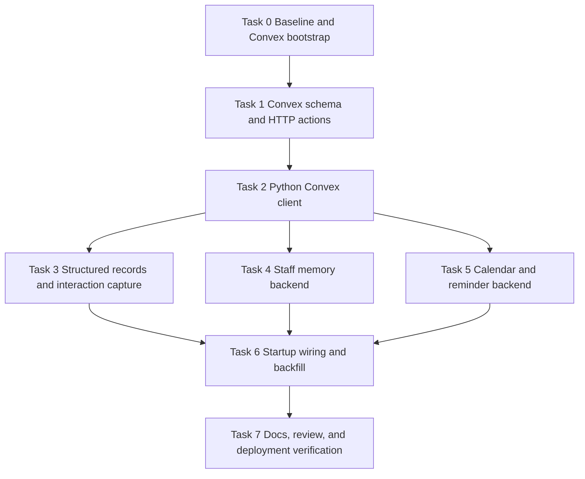

# Convex Persistence Foundation Implementation Plan

> **For agentic workers:** REQUIRED SUB-SKILL: Use superpowers:subagent-driven-development (recommended) or superpowers:executing-plans to implement this plan task-by-task. Steps use checkbox (`- [ ]`) syntax for tracking.

**Goal:** Introduce Convex as the primary structured persistence backend for users, notes, interactions, assignments, characterizations, daily reports, calendar events, and reminder configuration while keeping the existing FastAPI + LINE runtime intact.

**Architecture:** Add a small Convex workspace inside the repo for schema, indexes, and authenticated HTTP actions. Keep Python as the application runtime, and insert a narrow `ConvexClient` plus backend adapters so existing services such as calendar and staff memory can switch from local JSON/HF persistence to Convex without changing agent-facing APIs.

**Tech Stack:** Python 3, FastAPI, LINE Bot SDK v3, httpx, pytest/pytest-asyncio, Node.js/npm, Convex (TypeScript schema + HTTP actions).

---

## Goal and Non-Goals

**Included in this plan**
- Convex project bootstrap inside this repository
- Convex schema for users, notes, interactions, assignments, characterizations, daily reports, calendar events, and app settings
- Python-to-Convex integration through authenticated HTTP calls
- Calendar and reminder persistence moved behind a backend adapter that can use Convex
- Review-agent staff memory moved behind a backend adapter that can use Convex
- Structured interaction capture at the routing boundary so user activity is written to Convex
- Backfill script for existing local calendar and staff-memory data
- Environment, startup, readiness, and documentation updates

**Explicit non-goals**
- Building the admin-only configuration window itself
- Reworking document memory storage to Convex
- Replacing raw conversation transcript memory with Convex in this slice
- Changing news, search, translation, or profiler behavior
- Large router or agent refactors unrelated to persistence

**Follow-on work after this plan**
- Admin-only configuration surface backed by `appSettings`
- Assignment/reminder UX refinements
- Optional document/conversation migration to Convex if the first slice is stable

---

## Architecture Summary

The current codebase stores state in several separate ways: local JSON files, optional Hugging Face sync, and in-memory caches. This plan standardizes structured business data in Convex while preserving public Python service APIs. Agents continue talking to `StaffMemoryService`, `CalendarService`, and the startup bootstrap path; those services gain backend-aware repositories so the change stays local.

Convex will expose authenticated HTTP actions rather than forcing the Python runtime to speak undocumented internal APIs. The Python side will use a single `ConvexClient` wrapper built on the existing `httpx.AsyncClient` pattern, then compose that into focused services for structured records, staff memory, and calendar/reminder data. Startup will fail fast when Convex is configured as the primary backend but unreachable.

---

## File Responsibility Map

### New files

```text
package.json                                  # Node workspace for Convex CLI/runtime deps
tsconfig.json                                 # TypeScript config for Convex files
convex/schema.ts                              # Table schema, indexes, and validators
convex/http.ts                                # Authenticated HTTP action routes for Python
convex/users.ts                               # User profile upsert/read operations
convex/records.ts                             # Notes, interactions, assignments, characterizations, daily reports
convex/calendar.ts                            # Calendar event CRUD + due reminder queries
convex/settings.ts                            # App settings storage for future admin-only UI
src/services/convex_client.py                 # Shared HTTP client wrapper and error mapping
src/services/structured_records_service.py    # User/interactions/notes/assignments/characterizations/daily reports facade
src/services/convex_calendar_repository.py    # Calendar repository backed by Convex HTTP actions
src/services/convex_staff_memory_repository.py# Staff-memory repository backed by Convex HTTP actions
scripts/convex_backfill.py                    # One-shot migration from local JSON data to Convex
tests/test_convex_client.py                   # Unit tests for auth, payloads, error handling
tests/test_structured_records_service.py      # Unit tests for structured record mapping and writes
tests/test_agent_router.py                    # Router result metadata tests for interaction capture
tests/test_calendar_service_convex.py         # Calendar adapter tests with Convex backend
```

### Modified existing files

```text
.env.example                                  # Add Convex environment variables
.gitignore                                    # Ignore Node/Convex local artifacts
src/config.py                                 # Convex settings and backend selection
src/main.py                                   # Convex startup wiring, readiness, and interaction capture bootstrap
src/agents/agent_router.py                    # Return or expose handled-agent metadata for interaction recording
src/services/staff_memory_service.py          # Delegate persistence to repository interface
src/services/calendar_service.py              # Delegate event persistence to repository interface
src/services/reminder_service.py              # Query due reminders through repository-backed calendar service
src/services/startup_data_loader.py           # Convex health/readiness checks when selected as primary backend
src/agents/review_agent.py                    # Continue working against updated staff-memory/calendar services
tests/test_staff_memory_service.py            # Cover repository-backed behavior and fallback
tests/test_review_agent.py                    # Prove review flow still saves staff-memory items with Convex backend
tests/test_main.py                            # Startup readiness and service wiring coverage
README.md                                     # Mention Convex-backed structured persistence
docs/reference/environment.md                 # Document new Convex environment variables
docs/CALENDAR_REMINDERS.md                    # Document Convex-backed calendar/reminder persistence
docs/KPS_ASSISTANT.md                         # Document structured memory domains and storage behavior
```

### Leave untouched in this plan

```text
src/agents/news_agent.py
src/agents/search_agent.py
src/agents/translation_agent.py
src/agents/profiler_agent.py
src/services/document_memory_service.py
src/services/conversation_memory_service.py
src/handlers/message_handler.py
python-connector-api/
mcp/
```

---

## Data Model Summary

Convex tables introduced in this plan:

- `users`: LINE user identity, display metadata, role flags, timestamps
- `interactions`: inbound message summaries, selected agent, chat scope, timestamps
- `notes`: freeform notes tied to a user or chat
- `assignments`: task/assignment records with due dates and status
- `characterizations`: structured learner/persona summaries with source and confidence
- `dailyReports`: daily report text plus date, owner, and chat scope
- `calendarEvents`: existing calendar event fields plus reminder metadata and delivery state
- `appSettings`: persisted feature flags, reminder defaults, and future admin-window settings

All records should carry `sourceChatId`, `lineUserId` when applicable, and `createdAt` / `updatedAt` timestamps so the later admin UI does not need another migration.

---

## Dependency Order



Parallel work allowed after Task 2:
- Task 4 staff memory backend
- Task 5 calendar/reminder backend

---

## Task 0: Baseline and Convex Workspace Bootstrap

**Files:**
- Create: `package.json`
- Create: `tsconfig.json`
- Modify: `.gitignore`
- Modify: `.env.example`
- Test: `tests/test_staff_memory_service.py`
- Test: `tests/test_review_agent.py`
- Test: `tests/test_calendar_agent.py`
- Test: `tests/test_main.py`

- [ ] **Step 1: Run the current focused Python baseline before introducing Convex**

Run:

```bash
pytest tests/test_staff_memory_service.py tests/test_review_agent.py tests/test_calendar_agent.py tests/test_main.py -q
```

Expected:

```text
PASS
```

- [ ] **Step 2: Add the minimal Node workspace required for Convex**

Create `package.json`:

```json
{
  "name": "teacherboy-convex",
  "private": true,
  "scripts": {
    "convex:dev": "convex dev",
    "convex:codegen": "convex codegen",
    "convex:deploy": "convex deploy"
  },
  "devDependencies": {
    "convex": "^1.16.0",
    "typescript": "^5.6.3"
  }
}
```

Create `tsconfig.json`:

```json
{
  "compilerOptions": {
    "target": "ES2022",
    "lib": ["ES2022"],
    "module": "ESNext",
    "moduleResolution": "Bundler",
    "strict": true,
    "noEmit": true,
    "skipLibCheck": true
  },
  "include": ["convex/**/*.ts"]
}
```

- [ ] **Step 3: Ignore local Node and Convex artifacts, but keep source files tracked**

Append to `.gitignore`:

```gitignore
node_modules/
.convex/
```

- [ ] **Step 4: Add Convex environment variables to `.env.example` without removing existing local/HF options**

Add:

```bash
# Convex structured persistence
PERSISTENCE_BACKEND=local
CONVEX_DEPLOYMENT_URL=
CONVEX_SYNC_TOKEN=
CONVEX_REQUEST_TIMEOUT_SECONDS=10
CONVEX_REQUIRE_HEALTHCHECK_ON_STARTUP=false
```

- [ ] **Step 5: Install Node dependencies and link the existing Convex project**

Run:

```bash
npm install
npx convex dev --configure=existing
```

Expected:

```text
✔ Project configured
✔ Watching Convex functions for changes
```

- [ ] **Step 6: Commit the workspace bootstrap**

Run:

```bash
git add package.json tsconfig.json .gitignore .env.example
git commit -m "chore: bootstrap convex workspace"
```

Expected:

```text
[main ...] chore: bootstrap convex workspace
```

---

## Task 1: Convex Schema and Authenticated HTTP Actions

**Files:**
- Create: `convex/schema.ts`
- Create: `convex/http.ts`
- Create: `convex/users.ts`
- Create: `convex/records.ts`
- Create: `convex/calendar.ts`
- Create: `convex/settings.ts`

- [ ] **Step 1: Define the Convex schema with the exact tables needed by the approved storage design**

Create `convex/schema.ts` with tables shaped like:

```ts
import { defineSchema, defineTable } from "convex/server";
import { v } from "convex/values";

export default defineSchema({
  users: defineTable({
    lineUserId: v.string(),
    displayName: v.optional(v.string()),
    role: v.optional(v.string()),
    aliases: v.optional(v.array(v.string())),
    createdAt: v.string(),
    updatedAt: v.string(),
  }).index("by_line_user_id", ["lineUserId"]),

  interactions: defineTable({
    lineUserId: v.optional(v.string()),
    sourceChatId: v.string(),
    messageType: v.string(),
    direction: v.string(),
    textPreview: v.optional(v.string()),
    handledAgent: v.optional(v.string()),
    createdAt: v.string(),
  }).index("by_chat_created", ["sourceChatId", "createdAt"]),

  notes: defineTable({
    ownerLineUserId: v.optional(v.string()),
    sourceChatId: v.string(),
    title: v.string(),
    body: v.string(),
    tags: v.array(v.string()),
    createdAt: v.string(),
    updatedAt: v.string(),
  }),

  assignments: defineTable({
    ownerLineUserId: v.optional(v.string()),
    sourceChatId: v.string(),
    title: v.string(),
    details: v.optional(v.string()),
    dueDate: v.optional(v.string()),
    status: v.string(),
    createdAt: v.string(),
    updatedAt: v.string(),
  }).index("by_owner_status", ["ownerLineUserId", "status"]),

  characterizations: defineTable({
    ownerLineUserId: v.optional(v.string()),
    sourceChatId: v.string(),
    summary: v.string(),
    source: v.string(),
    confidence: v.optional(v.number()),
    createdAt: v.string(),
    updatedAt: v.string(),
  }),

  dailyReports: defineTable({
    ownerLineUserId: v.optional(v.string()),
    sourceChatId: v.string(),
    reportDate: v.string(),
    summary: v.string(),
    createdAt: v.string(),
    updatedAt: v.string(),
  }).index("by_owner_day", ["ownerLineUserId", "reportDate"]),

  calendarEvents: defineTable({
    legacyEventId: v.string(),
    lineUserId: v.string(),
    sourceChatId: v.string(),
    title: v.string(),
    description: v.optional(v.string()),
    eventDate: v.string(),
    reminderDays: v.array(v.number()),
    notificationTargetUserId: v.optional(v.string()),
    notifiedDates: v.array(v.string()),
    createdAt: v.string(),
    updatedAt: v.string(),
  }).index("by_user_event_date", ["lineUserId", "eventDate"])
    .index("by_chat_event_date", ["sourceChatId", "eventDate"]),

  appSettings: defineTable({
    key: v.string(),
    value: v.any(),
    updatedBy: v.optional(v.string()),
    updatedAt: v.string(),
  }).index("by_key", ["key"]),
});
```

- [ ] **Step 2: Implement HTTP action routes that Python can call with a shared admin token**

Create `convex/http.ts` with routes like:

```ts
import { httpRouter } from "convex/server";
import { httpAction } from "./_generated/server";

const http = httpRouter();

function requireToken(request: Request) {
  const token = request.headers.get("authorization")?.replace("Bearer ", "");
  if (!process.env.CONVEX_SYNC_TOKEN || token !== process.env.CONVEX_SYNC_TOKEN) {
    throw new Response("unauthorized", { status: 401 });
  }
}

http.route({
  path: "/records/upsertUser",
  method: "POST",
  handler: httpAction(async (ctx, request) => {
    requireToken(request);
    const body = await request.json();
    return Response.json(await ctx.runMutation("users:upsertUser", body));
  }),
});
```

Expose routes for:
- `/records/upsertUser`
- `/records/appendInteraction`
- `/records/createNote`
- `/records/createAssignment`
- `/records/createCharacterization`
- `/records/createDailyReport`
- `/calendar/upsertEvent`
- `/calendar/listUserEvents`
- `/calendar/listChatEvents`
- `/calendar/getDueReminders`
- `/calendar/markNotified`
- `/settings/get`
- `/settings/set`
- `/health`

- [ ] **Step 3: Implement the underlying Convex mutations/queries in focused modules**

Add function signatures shaped like:

```ts
export const upsertUser = mutation({
  args: {
    lineUserId: v.string(),
    displayName: v.optional(v.string()),
    role: v.optional(v.string()),
    aliases: v.optional(v.array(v.string())),
  },
  handler: async (ctx, args) => {
    // upsert by lineUserId
  },
});
```

Keep each file focused:
- `users.ts` only user lookup/upsert
- `records.ts` only notes/interactions/assignments/characterizations/daily reports
- `calendar.ts` only calendar reminder and event operations
- `settings.ts` only app-setting reads/writes

- [ ] **Step 4: Validate the Convex TypeScript layer before touching Python**

Run:

```bash
npx convex codegen
```

Expected:

```text
Generated code into convex/_generated
```

- [ ] **Step 5: Commit the schema and HTTP contract**

Run:

```bash
git add convex package.json tsconfig.json
git commit -m "feat: add convex schema and http actions"
```

Expected:

```text
[main ...] feat: add convex schema and http actions
```

---

## Task 2: Python Convex Client and Configuration Surface

**Files:**
- Create: `src/services/convex_client.py`
- Create: `tests/test_convex_client.py`
- Modify: `src/config.py`

- [ ] **Step 1: Write the failing unit tests for the Python Convex client**

Create `tests/test_convex_client.py`:

```python
from unittest.mock import AsyncMock

import httpx
import pytest

from src.services.convex_client import ConvexClient, ConvexApiError


@pytest.mark.asyncio
async def test_convex_client_sends_bearer_token_and_json_payload():
    http_client = AsyncMock()
    http_client.post.return_value = httpx.Response(
        200,
        json={"ok": True},
        request=httpx.Request("POST", "https://convex.example/records/upsertUser"),
    )

    client = ConvexClient(
        base_url="https://convex.example",
        sync_token="secret",
        http_client=http_client,
    )

    await client.post("/records/upsertUser", {"lineUserId": "U1"})

    _, kwargs = http_client.post.call_args
    assert kwargs["headers"]["Authorization"] == "Bearer secret"
    assert kwargs["json"] == {"lineUserId": "U1"}


@pytest.mark.asyncio
async def test_convex_client_raises_api_error_for_non_200_response():
    http_client = AsyncMock()
    http_client.post.return_value = httpx.Response(
        500,
        text="boom",
        request=httpx.Request("POST", "https://convex.example/health"),
    )

    client = ConvexClient(
        base_url="https://convex.example",
        sync_token="secret",
        http_client=http_client,
    )

    with pytest.raises(ConvexApiError):
        await client.post("/health", {})
```

- [ ] **Step 2: Run the new client tests and confirm the expected failure**

Run:

```bash
pytest tests/test_convex_client.py -q
```

Expected:

```text
E   ModuleNotFoundError: No module named 'src.services.convex_client'
```

- [ ] **Step 3: Implement the minimal client and explicit config accessors**

Create `src/services/convex_client.py`:

```python
from __future__ import annotations

from dataclasses import dataclass
from typing import Any, Optional

import httpx


class ConvexApiError(RuntimeError):
    pass


@dataclass
class ConvexClient:
    base_url: str
    sync_token: str
    http_client: httpx.AsyncClient
    timeout_seconds: float = 10.0

    async def post(self, path: str, payload: dict[str, Any]) -> dict[str, Any]:
        response = await self.http_client.post(
            f"{self.base_url.rstrip('/')}{path}",
            json=payload,
            headers={"Authorization": f"Bearer {self.sync_token}"},
            timeout=self.timeout_seconds,
        )
        if response.status_code != 200:
            raise ConvexApiError(f"Convex request failed: {response.status_code} {response.text}")
        return response.json()

    async def healthcheck(self) -> bool:
        payload = await self.post("/health", {})
        return bool(payload.get("ok"))
```

Modify `src/config.py` to add:

```python
    persistence_backend: str = Field(
        default="local",
        description="Primary structured persistence backend: 'local' or 'convex'.",
    )
    convex_deployment_url: Optional[str] = Field(
        default=None,
        description="Base URL for Convex HTTP actions.",
    )
    convex_sync_token: Optional[str] = Field(
        default=None,
        description="Bearer token used by the Python runtime to call Convex HTTP actions.",
    )
    convex_request_timeout_seconds: int = Field(
        default=10,
        ge=1,
        le=60,
        description="Timeout for Convex HTTP requests.",
    )
    convex_require_healthcheck_on_startup: bool = Field(
        default=False,
        description="Fail startup if Convex is configured as primary persistence and healthcheck fails.",
    )
```

Add helpers:

```python
    def is_convex_configured(self) -> bool:
        return bool(self.convex_deployment_url and self.convex_sync_token)

    def is_convex_primary_backend(self) -> bool:
        return self.persistence_backend.lower() == "convex"
```

- [ ] **Step 4: Re-run the focused tests**

Run:

```bash
pytest tests/test_convex_client.py -q
```

Expected:

```text
2 passed
```

- [ ] **Step 5: Commit the client/config slice**

Run:

```bash
git add src/services/convex_client.py src/config.py tests/test_convex_client.py
git commit -m "feat: add convex python client and config"
```

---

## Task 3: Structured Records Service and Interaction Capture

**Files:**
- Create: `src/services/structured_records_service.py`
- Create: `tests/test_structured_records_service.py`
- Create: `tests/test_agent_router.py`
- Modify: `src/agents/agent_router.py`
- Modify: `src/main.py`

- [ ] **Step 1: Write failing tests for the structured-record facade and router metadata**

Create `tests/test_structured_records_service.py`:

```python
from unittest.mock import AsyncMock

import pytest

from src.services.structured_records_service import StructuredRecordsService


@pytest.mark.asyncio
async def test_record_interaction_posts_expected_payload():
    client = AsyncMock()
    service = StructuredRecordsService(client)

    await service.record_interaction(
        line_user_id="U1",
        source_chat_id="group_G1",
        message_type="text",
        direction="inbound",
        text_preview="hello",
        handled_agent="HelpAgent",
    )

    client.post.assert_awaited_once_with(
        "/records/appendInteraction",
        {
            "lineUserId": "U1",
            "sourceChatId": "group_G1",
            "messageType": "text",
            "direction": "inbound",
            "textPreview": "hello",
            "handledAgent": "HelpAgent",
        },
    )
```

Create `tests/test_agent_router.py`:

```python
from unittest.mock import AsyncMock, Mock

import pytest

from src.agents.agent_router import AgentRouter


class _FakeAgent:
    enabled = True
    name = "FakeAgent"
    description = "test"

    def get_priority(self):
        return 5

    async def should_handle(self, event, text):
        return True

    async def handle(self, event, text, line_bot_api):
        return True


@pytest.mark.asyncio
async def test_route_message_returns_handled_agent_metadata():
    router = AgentRouter()
    router.register_agent(_FakeAgent())

    event = Mock()
    event.message = Mock()
    event.message.text = "Ms. Green help"
    event.source = Mock(type="user", user_id="U1")

    result = await router.route_message(event, AsyncMock())

    assert result.handled is True
    assert result.agent_name == "FakeAgent"
```

- [ ] **Step 2: Run the focused tests and confirm failure before implementation**

Run:

```bash
pytest tests/test_structured_records_service.py tests/test_agent_router.py -q
```

Expected:

```text
FAIL
```

- [ ] **Step 3: Implement the structured-record facade and router result object**

Create `src/services/structured_records_service.py` with methods:

```python
class StructuredRecordsService:
    def __init__(self, convex_client):
        self._client = convex_client

    async def upsert_user(self, *, line_user_id: str, display_name: str | None = None, role: str | None = None) -> dict:
        return await self._client.post("/records/upsertUser", {
            "lineUserId": line_user_id,
            "displayName": display_name,
            "role": role,
        })

    async def record_interaction(self, *, line_user_id: str | None, source_chat_id: str, message_type: str, direction: str, text_preview: str | None = None, handled_agent: str | None = None) -> dict:
        return await self._client.post("/records/appendInteraction", {
            "lineUserId": line_user_id,
            "sourceChatId": source_chat_id,
            "messageType": message_type,
            "direction": direction,
            "textPreview": text_preview,
            "handledAgent": handled_agent,
        })
```

Modify `src/agents/agent_router.py` to return a lightweight result instead of bare `bool`:

```python
from dataclasses import dataclass


@dataclass
class RouteResult:
    handled: bool
    agent_name: str | None = None
    message_type: str | None = None
```

Update the return path so successful handling returns:

```python
return RouteResult(handled=True, agent_name=agent.name, message_type=message_type)
```

and no-match returns:

```python
return RouteResult(handled=False, agent_name=None, message_type=message_type)
```

Modify `src/main.py` so the webhook handler:
- calls `structured_records_service.upsert_user(...)` for known LINE users
- records an inbound interaction after routing completes
- stores `handled_agent` from `RouteResult.agent_name`
- treats Convex write failures as non-fatal when `PERSISTENCE_BACKEND=local`

- [ ] **Step 4: Re-run the focused tests and the existing startup tests**

Run:

```bash
pytest tests/test_structured_records_service.py tests/test_agent_router.py tests/test_main.py -q
```

Expected:

```text
PASS
```

- [ ] **Step 5: Commit the structured-record slice**

Run:

```bash
git add src/services/structured_records_service.py src/agents/agent_router.py src/main.py tests/test_structured_records_service.py tests/test_agent_router.py tests/test_main.py
git commit -m "feat: capture structured interactions in convex"
```

---

## Task 4: Staff Memory Backend Adapter

**Files:**
- Create: `src/services/convex_staff_memory_repository.py`
- Modify: `src/services/staff_memory_service.py`
- Modify: `tests/test_staff_memory_service.py`
- Modify: `tests/test_review_agent.py`

- [ ] **Step 1: Extend the staff-memory tests to prove repository-backed persistence works**

Add to `tests/test_staff_memory_service.py`:

```python
from unittest.mock import Mock


def test_staff_memory_delegates_add_item_to_repository(tmp_path):
    repository = Mock()
    service = StaffMemoryService(tmp_path / "staff_memory.json", repository=repository)

    service.add_item(
        title="Flag ceremony practice",
        summary="Flag ceremony practice this week",
        priority="P1",
        due_date=date(2026, 6, 2),
        source_chat_id="group_G1",
        created_by="U1",
    )

    repository.add_item.assert_called_once()
```

Add to `tests/test_review_agent.py` a case where a mocked repository-backed `StaffMemoryService` still stores review output.

- [ ] **Step 2: Run the focused staff-memory tests to confirm failure**

Run:

```bash
pytest tests/test_staff_memory_service.py tests/test_review_agent.py -q
```

Expected:

```text
FAIL
```

- [ ] **Step 3: Implement a repository-backed staff-memory service with JSON fallback preserved**

Create `src/services/convex_staff_memory_repository.py`:

```python
class ConvexStaffMemoryRepository:
    def __init__(self, convex_client):
        self._client = convex_client

    def add_item(self, *, title, summary, priority, due_date, source_chat_id, created_by):
        return asyncio.run(self._client.post("/records/createNote", {
            "title": title,
            "body": summary,
            "tags": [priority, "staff-memory"],
            "sourceChatId": source_chat_id,
            "ownerLineUserId": created_by,
            "dueDate": due_date.isoformat() if due_date else None,
        }))
```

Modify `src/services/staff_memory_service.py` so:
- the constructor accepts `repository: object | None = None`
- when `repository` is present, `add_item()` and `get_items_for_week()` delegate there
- when `repository` is absent, current JSON behavior remains unchanged
- the public API and return shape stay backward compatible for `ReviewAgent`

- [ ] **Step 4: Re-run the focused tests**

Run:

```bash
pytest tests/test_staff_memory_service.py tests/test_review_agent.py -q
```

Expected:

```text
PASS
```

- [ ] **Step 5: Commit the staff-memory migration slice**

Run:

```bash
git add src/services/convex_staff_memory_repository.py src/services/staff_memory_service.py tests/test_staff_memory_service.py tests/test_review_agent.py
git commit -m "feat: add convex-backed staff memory"
```

---

## Task 5: Calendar and Reminder Backend Adapter

**Files:**
- Create: `src/services/convex_calendar_repository.py`
- Create: `tests/test_calendar_service_convex.py`
- Modify: `src/services/calendar_service.py`
- Modify: `src/services/reminder_service.py`
- Modify: `tests/test_main.py`

- [ ] **Step 1: Write failing tests for a Convex-backed calendar repository while preserving current service APIs**

Create `tests/test_calendar_service_convex.py`:

```python
from datetime import date
from unittest.mock import AsyncMock

import pytest

from src.services.calendar_service import CalendarService


@pytest.mark.asyncio
async def test_calendar_service_uses_repository_for_due_reminders():
    repository = AsyncMock()
    repository.get_events_needing_reminder.return_value = [
        {"event": {"event_id": "1", "title": "Exam", "event_date": date.today(), "notification_target_user_id": "U1"}, "days_until": 0}
    ]

    service = CalendarService(repository=repository)
    results = await service.get_events_needing_reminder(date.today())

    assert results == repository.get_events_needing_reminder.return_value
    repository.get_events_needing_reminder.assert_awaited_once()
```

- [ ] **Step 2: Run the focused calendar/reminder tests and confirm failure**

Run:

```bash
pytest tests/test_calendar_service_convex.py tests/test_calendar_agent.py tests/test_main.py -q
```

Expected:

```text
FAIL
```

- [ ] **Step 3: Implement the Convex calendar repository and adapt `CalendarService` to use it**

Create `src/services/convex_calendar_repository.py` with methods:

```python
class ConvexCalendarRepository:
    def __init__(self, convex_client):
        self._client = convex_client

    async def upsert_event(self, event):
        return await self._client.post("/calendar/upsertEvent", event.to_dict())

    async def list_user_events(self, user_id: str):
        return await self._client.post("/calendar/listUserEvents", {"lineUserId": user_id})

    async def list_chat_events(self, chat_id: str):
        return await self._client.post("/calendar/listChatEvents", {"sourceChatId": chat_id})

    async def get_events_needing_reminder(self, today: date):
        return await self._client.post("/calendar/getDueReminders", {"today": today.isoformat()})
```

Modify `src/services/calendar_service.py` so:
- constructor optionally accepts `repository`
- current local/HF behavior remains the default when repository is absent
- public methods (`add_event`, `get_user_events`, `get_chat_events`, `remove_event`, `get_events_needing_reminder`, `mark_event_notified`) route to the repository when present
- existing `CalendarEvent` stays the public data structure

Modify `src/services/reminder_service.py` only enough to keep reminder delivery working through repository-backed `CalendarService` without changing message formatting.

- [ ] **Step 4: Re-run the focused calendar tests**

Run:

```bash
pytest tests/test_calendar_service_convex.py tests/test_calendar_agent.py tests/test_main.py -q
```

Expected:

```text
PASS
```

- [ ] **Step 5: Commit the calendar/reminder backend slice**

Run:

```bash
git add src/services/convex_calendar_repository.py src/services/calendar_service.py src/services/reminder_service.py tests/test_calendar_service_convex.py tests/test_main.py
git commit -m "feat: add convex-backed calendar persistence"
```

---

## Task 6: Startup Wiring, Backend Selection, and Backfill Script

**Files:**
- Create: `scripts/convex_backfill.py`
- Modify: `src/main.py`
- Modify: `src/services/startup_data_loader.py`
- Modify: `tests/test_main.py`

- [ ] **Step 1: Extend startup tests for Convex-first readiness and graceful local fallback**

Add to `tests/test_main.py` cases that verify:
- startup configures `ConvexClient` when `PERSISTENCE_BACKEND=convex`
- startup fails readiness when Convex is required and healthcheck fails
- startup keeps working when backend is `local` and Convex is unset

Use a pattern like:

```python
mock_settings.persistence_backend = "convex"
mock_settings.convex_deployment_url = "https://convex.example"
mock_settings.convex_sync_token = "secret"
mock_settings.convex_require_healthcheck_on_startup = True
```

- [ ] **Step 2: Run startup tests and confirm failure before wiring implementation**

Run:

```bash
pytest tests/test_main.py -q
```

Expected:

```text
FAIL
```

- [ ] **Step 3: Wire backend selection in `src/main.py` and readiness in `startup_data_loader.py`**

Implement startup logic shaped like:

```python
convex_client = None
structured_records_service = None

if settings.is_convex_primary_backend():
    if not settings.is_convex_configured():
        raise RuntimeError("Convex selected as primary persistence backend but not configured")

    convex_client = ConvexClient(
        base_url=settings.convex_deployment_url,
        sync_token=settings.convex_sync_token,
        http_client=http_client_pool,
        timeout_seconds=settings.convex_request_timeout_seconds,
    )
    structured_records_service = StructuredRecordsService(convex_client)
```

Update `StartupDataLoader` so it performs a `healthcheck()` instead of HF download when Convex is the selected backend for staff-memory/calendar data.

- [ ] **Step 4: Add an idempotent backfill script for existing calendar and staff-memory data**

Create `scripts/convex_backfill.py` with commands:

```python
import argparse


def main() -> int:
    parser = argparse.ArgumentParser()
    parser.add_argument("--dry-run", action="store_true")
    parser.add_argument("--apply", action="store_true")
    # load local staff memory and local calendar JSON
    # upsert users by created_by / notification_target_user_id
    # write notes for staff memory items
    # write calendarEvents with legacyEventId for idempotency
```

Backfill rules:
- use existing `event_id` as `legacyEventId`
- preserve `notification_target_user_id`
- create missing users on the fly
- never delete local files in this script

- [ ] **Step 5: Run focused startup tests and dry-run the backfill script**

Run:

```bash
pytest tests/test_main.py -q
python scripts/convex_backfill.py --dry-run
```

Expected:

```text
PASS
Dry run complete
```

- [ ] **Step 6: Commit the wiring and migration tooling**

Run:

```bash
git add src/main.py src/services/startup_data_loader.py scripts/convex_backfill.py tests/test_main.py
git commit -m "feat: wire convex backend selection and backfill"
```

---

## Task 7: Documentation, Review Gates, and Deployment Verification

**Files:**
- Modify: `README.md`
- Modify: `docs/reference/environment.md`
- Modify: `docs/CALENDAR_REMINDERS.md`
- Modify: `docs/KPS_ASSISTANT.md`

- [ ] **Step 1: Update the operator-facing docs to describe Convex as the structured persistence option**

Document all of the following:
- what `PERSISTENCE_BACKEND=convex` means
- required env vars: `CONVEX_DEPLOYMENT_URL`, `CONVEX_SYNC_TOKEN`, `CONVEX_REQUEST_TIMEOUT_SECONDS`
- that calendar and review-agent staff memory can now use Convex
- that the admin-only config window is not yet implemented, but `appSettings` is now the persistence target for it
- rollback path: set `PERSISTENCE_BACKEND=local` and restart the app

- [ ] **Step 2: Run focused verification for the changed slices**

Run:

```bash
pytest tests/test_convex_client.py tests/test_structured_records_service.py tests/test_agent_router.py tests/test_staff_memory_service.py tests/test_review_agent.py tests/test_calendar_service_convex.py tests/test_main.py -q
```

Expected:

```text
PASS
```

- [ ] **Step 3: Validate the Convex workspace again before final verification**

Run:

```bash
npx convex codegen
```

Expected:

```text
Generated code into convex/_generated
```

- [ ] **Step 4: Run the broader regression suite covering startup, review, and calendar behavior**

Run:

```bash
pytest tests/test_staff_memory_service.py tests/test_review_agent.py tests/test_calendar_agent.py tests/test_calendar_security.py tests/test_main.py -q
```

Expected:

```text
PASS
```

- [ ] **Step 5: Run the full repository verification before deployment**

Run:

```bash
pytest -q
```

Expected:

```text
all tests passed
```

- [ ] **Step 6: Deploy Convex and switch the runtime only after verification passes**

Run:

```bash
npx convex deploy
python scripts/convex_backfill.py --apply
```

Expected:

```text
Convex deployment successful
Backfill complete
```

- [ ] **Step 7: Final review and commit**

Review checklist:
- Convex token is never logged
- HTTP actions reject missing/invalid bearer tokens
- `PERSISTENCE_BACKEND=local` still works
- calendar reminder delivery still uses `notification_target_user_id`
- no existing agent changed behavior outside persistence

Run:

```bash
git add README.md docs/reference/environment.md docs/CALENDAR_REMINDERS.md docs/KPS_ASSISTANT.md
git commit -m "docs: document convex persistence foundation"
```

---

## Review Steps

Before implementation is considered complete, perform these review gates in order:

1. Schema review: verify each approved domain maps to exactly one Convex table and required indexes exist.
2. Security review: verify HTTP actions require bearer auth and no secrets are logged or committed.
3. Compatibility review: verify `ReviewAgent`, `CalendarService`, and reminder delivery preserve existing public behavior.
4. Rollback review: verify setting `PERSISTENCE_BACKEND=local` restores pre-Convex behavior without data loss in local files.

---

## Deployment Steps

1. Set `CONVEX_DEPLOYMENT_URL` and `CONVEX_SYNC_TOKEN` in the runtime environment.
2. Keep `PERSISTENCE_BACKEND=local` during the first deploy.
3. Run `npx convex deploy`.
4. Run `python scripts/convex_backfill.py --dry-run` and inspect counts.
5. Run `python scripts/convex_backfill.py --apply`.
6. Flip `PERSISTENCE_BACKEND=convex`.
7. Restart the FastAPI runtime and verify startup health.
8. Trigger one review flow and one calendar reminder path manually.

Rollback:

1. Set `PERSISTENCE_BACKEND=local`.
2. Restart the app.
3. Leave Convex data intact for later retry; do not delete local JSON/HF data.

---

## Self-Review

- Spec coverage: this plan covers the approved persistence foundation only and intentionally leaves the admin-only config window as a follow-on feature using the new `appSettings` store.
- Completion scan: no unfinished markers remain.
- Consistency check: `ConvexClient`, `StructuredRecordsService`, `ConvexStaffMemoryRepository`, and `ConvexCalendarRepository` use the same authenticated HTTP-action boundary throughout the plan.